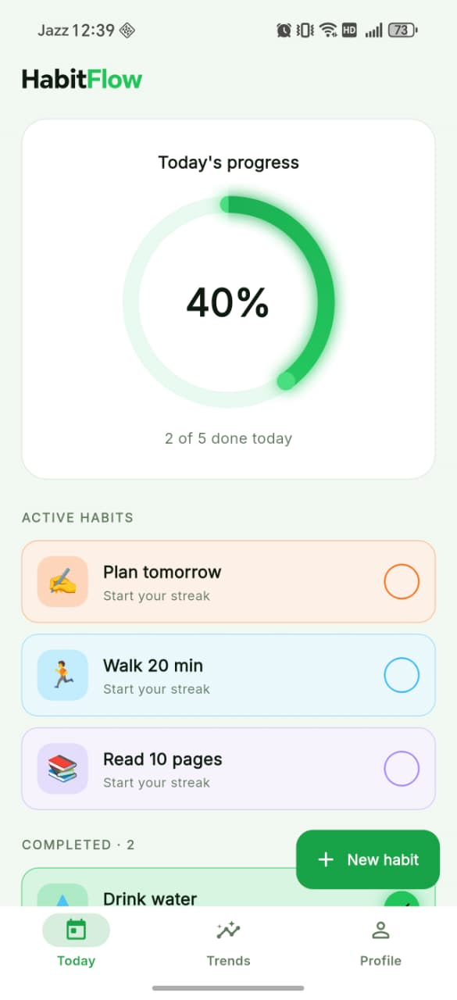
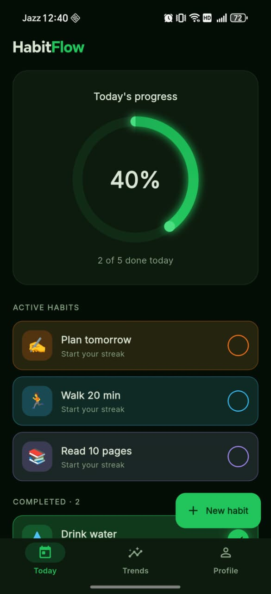
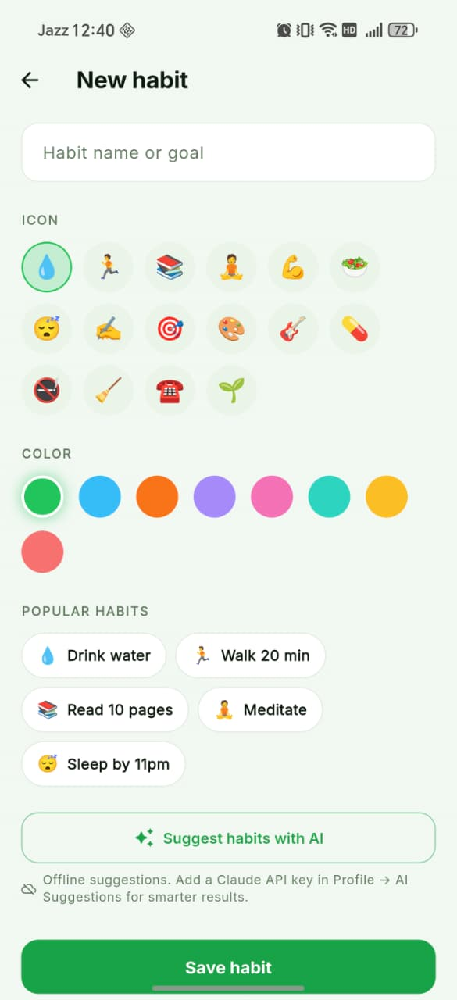
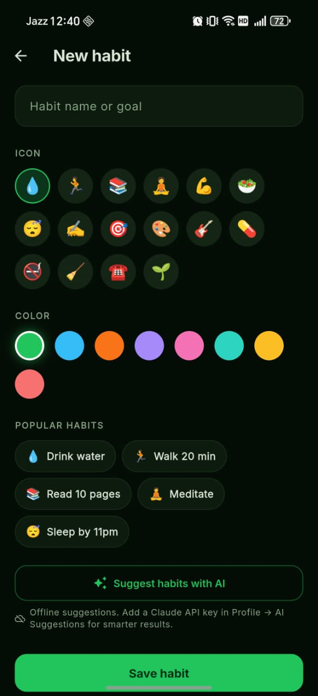
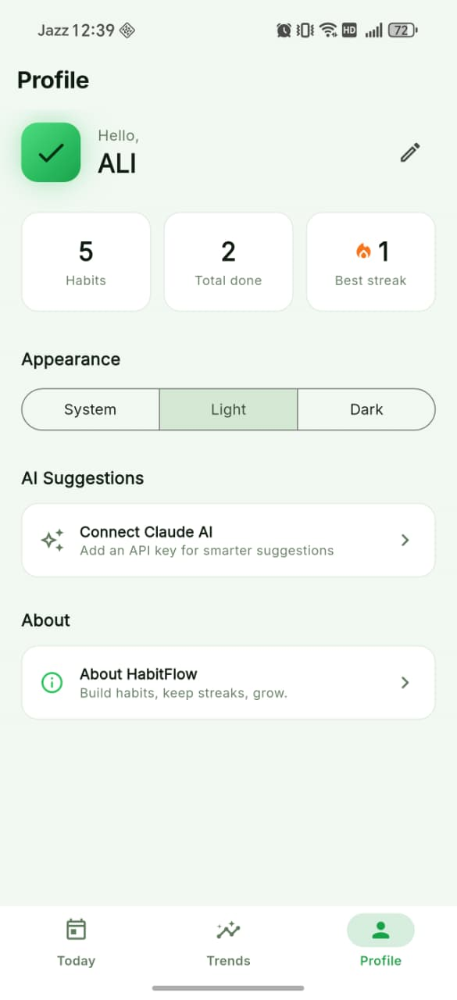
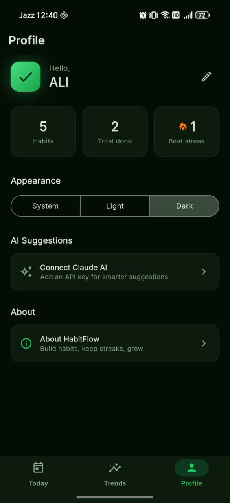
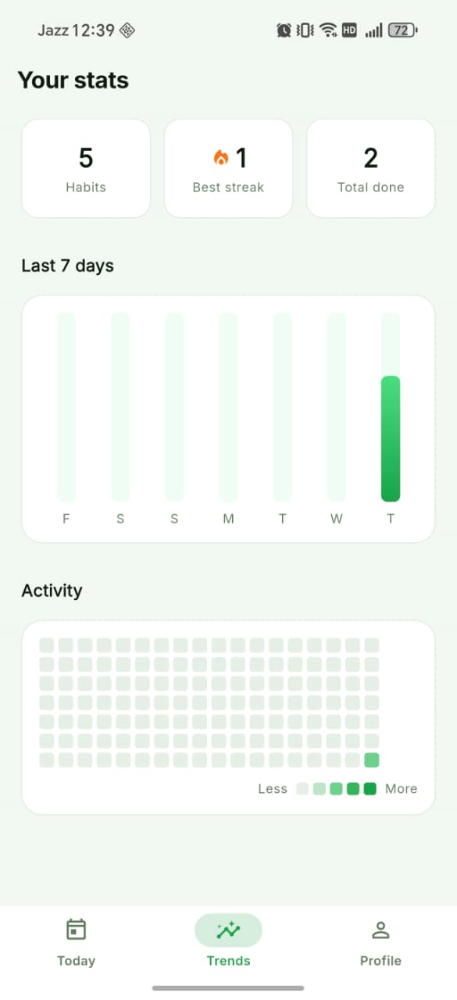
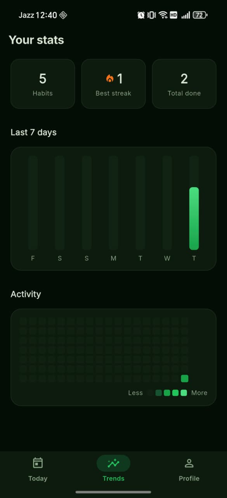
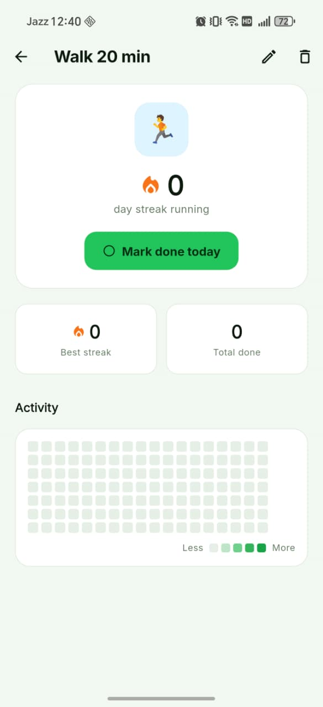
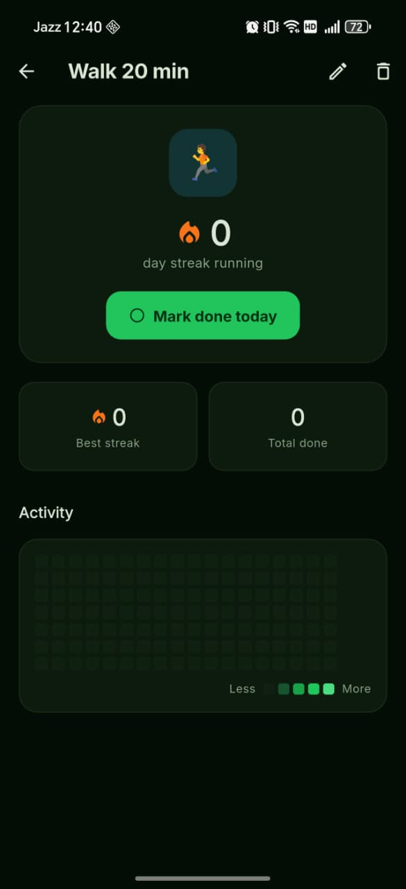

# 🌱 HabitFlow — Flutter App

**Build habits · Keep streaks · Grow**

HabitFlow is a Flutter mobile app for building daily habits and keeping streaks alive. Track your habits with a tappable progress ring, watch your consistency grow on a GitHub-style contribution heatmap, and get personalized habit ideas — powered by Claude AI (with smart offline suggestions out of the box). Wrapped in a calm, dark-first "Lush Zenith" emerald design.

## Screenshots

<p align="center">
  
  
  
  
  
  
</p>

<p align="center">
  
  
  
  
</p>

## Features

| Feature | Detail |
| --- | --- |
| Today dashboard | Daily progress ring (animated, glowing) with "X of Y done today", habits split into **Active** and **Completed** |
| Color-tinted habit cards | Each card's whole container is tinted with the habit's color — emoji tile, border, and tap-to-complete check ring |
| One-tap completion | Tap the check ring to mark done/undone; swipe a card left to delete |
| Streaks | Current streak shown with a flame badge; best (longest) streak tracked per habit |
| Trends | Habits / Best streak / Total-done stat cards, a 7-day completion bar chart, and a contribution heatmap |
| Add / Edit habit | Name field, emoji picker, color picker, and edit support for existing habits |
| Popular habits | Zero-setup starter chips (Drink water, Walk 20 min, Read, Meditate, Sleep) that prefill the form |
| AI suggestions | Goal-based habit ideas from Claude when a key is set; curated offline suggestions otherwise |
| Habit detail | Per-habit streak hero, mark-done button, best-streak / total stats, and an activity heatmap |
| Profile | Editable name, lifetime stats, light/dark/system theme switcher, AI key setup, about |
| Persistence | Habits and settings stored locally with Hive — fully offline |
| Theming | Dark-first "Lush Zenith" emerald palette with a faithful light theme; custom app icon + splash |

## Project structure

```
habitflow/
  lib/
    main.dart                          ← Bootstrap: Hive + notifications init
    app.dart                           ← MaterialApp + Provider wiring + theme
    core/
      constants/app_constants.dart     ← App name, Hive keys, emoji/color palettes, Claude config
      theme/
        app_colors.dart                ← "Lush Zenith" color tokens
        app_palette.dart               ← ThemeExtension: light/dark surfaces, borders, heat scale
        app_theme.dart                 ← Light + dark ThemeData (Inter type)
      utils/date_utils.dart            ← DateKeys + StreakCalculator
      services/
        ai_service.dart                ← Claude Messages API (raw HTTP) + offline fallback
        notification_service.dart      ← Local reminders (flutter_local_notifications)
        settings_controller.dart       ← Theme mode, display name, Claude API key (persisted)
    data/
      models/habit.dart                ← Habit model (JSON-serialized into Hive)
      repositories/habit_repository.dart
    features/
      shell/main_shell.dart            ← Bottom nav: Today · Trends · Profile
      splash/screens/splash_screen.dart
      habits/
        controller/habit_controller.dart   ← ChangeNotifier state
        screens/                       ← home_screen, add_habit_screen, habit_detail_screen
        widgets/habit_card.dart
      stats/screens/stats_screen.dart
      profile/screens/profile_screen.dart
    shared/
      widgets/                         ← progress_ring, heatmap_grid, streak_badge,
                                         stat_card, app_logo
  assets/
    logo.svg                           ← Source image for the launcher icon & splash
  screenshots/                         ← App screenshots used in this README
```

## Setup

### 1. Install dependencies

```bash
flutter pub get
```

### 2. (Optional) Enable AI habit suggestions

Suggestions work **offline out of the box**. For smart, goal-personalized ideas, add an Anthropic Claude API key — two ways:

- **In the app:** Profile → **AI Suggestions** → paste your key (stored only on-device), or
- **At build time:**

```bash
flutter run --dart-define=CLAUDE_API_KEY=sk-ant-...
```

Get a key at [console.anthropic.com](https://console.anthropic.com). Without a key, the app uses a curated offline suggestion list.

### 3. (Optional) Regenerate launcher icons

```bash
dart run flutter_launcher_icons
```

### 4. Run

```bash
flutter run
```

## How it works

### Completion flow

```
Habit list (Hive)
         │
         ▼
  Tap the check ring on a card
  ├── not done → mark complete for today (streak grows)
  └── done     → unmark
         │
         ▼
  HabitController updates → progress ring + sections rebuild
         │
         ▼
  Saved back to Hive (survives restarts)
```

### Persistence

```
Hive  (Box<String> 'habits_box' + 'settings_box')
         │
         ▼
  HabitRepository  ← load / save habits as JSON
         │
         ▼
  HabitController  (Provider ChangeNotifier)
         │
         ▼
  Screens rebuild on change
```

### AI suggestions

```
Type a goal → tap "Suggest habits with AI"
         │
         ├── Claude key set → AiService → HTTPS call to Claude Messages API
         │                                 → personalized habit ideas
         └── no key         → curated offline suggestions
         │
         ▼
  Tap a suggestion → prefills name + emoji
```

## Key dependencies

| Package | Purpose |
| --- | --- |
| `provider` | State management (`ChangeNotifier`) |
| `hive` / `hive_flutter` | Offline persistence for habits & settings |
| `fl_chart` | 7-day completion bar chart |
| `flutter_svg` | Renders the SVG logo on the splash |
| `google_fonts` | Inter typography |
| `flutter_local_notifications` | Daily habit reminders |
| `intl` | Date formatting / keys |
| `http` | Claude Messages API calls |
| `uuid` | Habit ids |
| `timezone` | Scheduled-notification time zones |
| `flutter_launcher_icons` | Adaptive launcher icon generation |

## Design

Dark-first **"Lush Zenith"** cinematic palette: deep near-black green background (`#050D05`), emerald primary (`#22C55E`) and bright emerald (`#4ADE80`), with flame-orange (`#F97316`) reserved exclusively for streaks. A faithful light theme is provided via a `ThemeExtension`. See `lib/core/theme/app_colors.dart` and `app_palette.dart` for the full tokens.

## Troubleshooting

- **`Could not resolve flutter_web_plugins` (web)** — run `flutter clean && flutter pub get`. The package is declared explicitly in `pubspec.yaml`.
- **Android: "core library desugaring … required"** — already enabled in `android/app/build.gradle.kts` (`isCoreLibraryDesugaringEnabled = true` + `desugar_jdk_libs`). If Gradle's cache misbehaves, stop daemons and clear `~/.gradle/caches/<ver>/transforms`.
- **AI suggestions look generic** — that's the offline fallback; add your Claude key in Profile → AI Suggestions.
- **New launcher icon not showing** — reinstall the app (OS icons aren't hot-reloaded).

## Building a release APK

```bash
flutter build apk --release --split-per-abi
```
